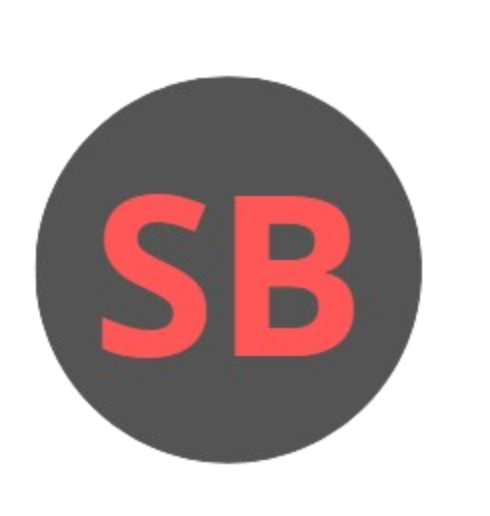

<div align="center">
 
## Portafolio Personal — Sergio Andrés Bustos
 

 
<hr>
 
</div>
 
**Sitio web personal que presenta mi perfil como desarrollador, mis proyectos y habilidades técnicas.**
 
[](https://developer.mozilla.org/es/docs/Web/HTML)
[](https://developer.mozilla.org/es/docs/Web/CSS)
[](https://developer.mozilla.org/es/docs/Web/JavaScript)
[](https://getbootstrap.com/)
[](https://icons.getbootstrap.com/)
[](https://fonts.google.com/)
[](https://developer.mozilla.org/es/docs/Web/API/Intersection_Observer_API)
[](https://developer.mozilla.org/es/docs/Web/API/Window/localStorage)
 
---
 
## 📖 ¿Qué es este portafolio?
 
Este es mi sitio web personal como desarrollador de software. Presenta mi perfil, proyectos destacados, habilidades técnicas y certificados obtenidos. El diseño es completamente propio, sin plantillas externas, con soporte para **modo oscuro y claro**, animaciones de entrada al hacer scroll, y un sistema de navegación activa sincronizado con el desplazamiento de la página.
 
> Diseño responsive optimizado para escritorio y móvil, con énfasis en rendimiento, accesibilidad y experiencia de usuario.
 
---
 
## 🧩 Características principales
 
- 🌙 **Tema oscuro/claro** — Toggle persistente con `localStorage`, sin parpadeo al recargar
- 🎞️ **Scroll reveal** — Animaciones de entrada suaves al hacer scroll usando `IntersectionObserver`
- 🔗 **Navegación activa** — Enlace de nav sincronizado en tiempo real con la sección visible
- 📊 **Barras de progreso animadas** — Se activan al entrar al viewport con `IntersectionObserver`
- 🧭 **Navbar dinámico** — Sombra adaptativa al desplazarse con scroll listener pasivo
- 🎴 **Íconos flotantes** — Animación CSS escalonada con `--delay` en las tarjetas de habilidades
- 📄 **Descarga de certificados** — PDFs descargables directamente desde el sitio
- 📱 **Responsive completo** — Layout adaptable a cualquier tamaño de pantalla
 
---
 
## ⚙️ Tecnologías utilizadas
 
### 🖥️ Frontend
 
| Tecnología | Uso |
|------------|-----|
| HTML5 | Estructura semántica y accesible con etiquetas correctas |
| CSS3 | Sistema de diseño propio con variables CSS (`--accent`, `--bg`, `--radius`, etc.) |
| JavaScript ES6+ | Theme toggle, scroll reveal, nav activo y animaciones |
| Bootstrap 5.3 | Grid system, componentes responsivos y utilidades |
| Bootstrap Icons 1.11 | Íconos SVG para redes sociales, navegación y UI general |
 
### 🔤 Tipografía
 
| Fuente | Uso |
|--------|-----|
| Plus Jakarta Sans | Fuente principal para cuerpo y UI (pesos 300–800) |
| Playfair Display | Títulos decorativos con serifa (normal e itálica) |
| JetBrains Mono | Etiquetas de tecnología y elementos tipo código |
 
### 🌐 APIs Web nativas
 
| API | Uso |
|-----|-----|
| IntersectionObserver API | Scroll reveal y animación de barras de progreso |
| localStorage API | Persistencia del tema seleccionado entre sesiones |
| Scroll Event API | Sombra dinámica del navbar y detección de sección activa |
 
### 🎨 Sistema de diseño
 
| Elemento | Detalle |
|----------|---------|
| Tema oscuro | `--bg: #0D0C0B`, `--accent: #5EC4FF`, `--red: #FF6B58` |
| Tema claro | `--bg: #F7F4EF`, `--accent: #D94F3D` |
| Radio de bordes | `--radius: 18px`, `--radius-sm: 10px`, `--radius-xs: 6px` |
| Transición global | `cubic-bezier(0.4, 0, 0.2, 1)` en 320ms |
| Animación flotante | CSS `@keyframes` con `animation-delay` por variable `--delay` |
 
---
 
## 📁 Estructura del proyecto
 
```
portfolio/
├── index.html                        # Página principal
├── styles.css                        # Hoja de estilos principal (variables, temas, componentes)
├── script.js                         # Lógica JS (tema, scroll reveal, nav activo, progreso)
├── skills-float.css                  # Animación flotante de los íconos de habilidades
├── README.md
├── certificadodeflask.html
├── certificadohtmlcss.html
├── certificadoingles.html
├── certificadomarcapersonal.html
├── certificadopoo.html
├── certificadopython.html
├── certificadoscrum.html
├── certificadotecnico.html
├── docs/
│   ├── CERTIFICADO DE FLASK.pdf
│   ├── CERTIFICADO DE HTML Y CSS.pdf
│   ├── CERTIFICADO DE INGLES.pdf
│   ├── CERTIFICADO DE MARCA PERSONAL.pdf
│   ├── CERTIFICADO DE SCRUM.pdf
│   ├── CERTIFICADO DE VARIABLES Y ESTRUCTURAS.pdf
│   └── CERTIFICADO-DE-POO.pdf
└── images/
    ├── favicon.ico
    ├── vscode.png
    ├── certificadoflask.jfif
    ├── certificadohtmlcss.jfif
    ├── certificadoingles.png
    ├── certificadomarcapersonal.png
    ├── certificadopoo.png
    ├── certificadopython.png
    ├── certificadoscrum.png
    └── certificadotecnico.png
```
 
---
 
## 🚀 Cómo visualizarlo
 
No requiere instalación ni servidor. Solo abre el archivo directamente en tu navegador:
 
```bash
# Opción 1 — Abrir directo
Doble clic en index.html
 
# Opción 2 — Servidor local con VS Code
# Instala la extensión Live Server y haz clic en "Go Live"
 
# Opción 3 — Servidor local con Python
python -m http.server 8000
# Luego abre: http://localhost:8000
```
 
---
 
## 📜 Certificados incluidos
 
| Certificado | Tecnología |
|-------------|-----------|
| Técnico en Programación de Software | SENA |
| HTML y CSS | Fundamentos web |
| Python | Variables y estructuras |
| POO | Programación Orientada a Objetos |
| Flask | Desarrollo web con Python |
| SCRUM | Metodología ágil |
| Inglés | Comunicación técnica |
| Marca Personal | Desarrollo profesional |
 
---
 
## 👤 Autor
 
**Sergio Andrés Bustos Mondragón** — Desarrollador Frontend  
Líder funcional del proyecto [NoteFlow](https://github.com/Sergio-Bustos/NoteFlow) · SENA 2025
 
---
 
<div align="center">
  <span style="font-weight: 900; font-size: 1.1em;">"El código limpio no se escribe, se refactoriza."</span>
  <br><br>
  Hecho con 💙 por Sergio Bustos · 2025
</div>
 
